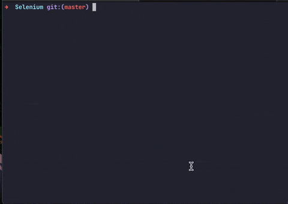

[![MIT License][license-shield]][license-url]
[![LinkedIn][linkedin-shield]][linkedin-url]

<br />
<p align="center">
  <a href="https://github.com/dave-martinez/php-casey-script">
    
  </a>

  <h3 align="center">PHP Casey Application Scraper</h3>

  <p align="center">
    A web scraper that fetches applications submitted on the website that was written in PHP, php-webdriver and Selenium.
    <br />
  </p>
</p>


<details open="open">
  <summary><h2 style="display: inline-block">Table of Contents</h2></summary>
  <ol>
    <li>
      <a href="#about-the-project">About The Project</a>
      <ul>
        <li><a href="#built-with">Built With</a></li>
      </ul>
    </li>
    <li>
      <a href="#getting-started">Getting Started</a>
      <ul>
        <li><a href="#prerequisites">Prerequisites</a></li>
        <li><a href="#installation">Installation</a></li>
      </ul>
    </li>
    <li><a href="#usage">Usage</a></li>
    <li><a href="#license">License</a></li>
    <li><a href="#contact">Contact</a></li>
  </ol>
</details>


## About The Project

[![Product Name Screen Shot][product-screenshot]](images/usage-2.gif)


A web scraper that fetches applications submitted on the website that was written in PHP, php-webdriver and Selenium.

This is part of an interview assignment to demonstrate scripting and scraping knowledge.


### Built With

* [Selenium](https://www.selenium.dev)
* [PHP-WebDriver](https://github.com/php-webdriver/php-webdriver)
* [PHP Simple HTML DOM Parser](https://simplehtmldom.sourceforge.io)


## Getting Started

To get a local copy up and running follow these simple steps.

### Installation

1. Install [Composer](https://www.google.com/search?client=safari&rls=en&q=composer&ie=UTF-8&oe=UTF-8)

   ```sh
   curl -sS https://getcomposer.org/installer | php  
   
   ```

2. Install the library

   ```sh
   php composer.phar require php-webdriver/webdriver
   ```

3. On Mac, install [Chromedriver](https://chromedriver.chromium.org) using [Homebrew](https://formulae.brew.sh)
   ```sh
   brew install --cask chromedriver
   ```

4. Install [Selenium](https://www.selenium.dev/downloads/)
   ```sh
   brew install selenium-server-standalone
   ```


## Usage

1. To run the script, first run selenium-driver
    ```sh
    selenium-driver
    ```
    

2. Then run the php script
    ```sh
    php caseyScraperPagination_v2
    ```
    

    After the script has run, it will output the results to a file called `results.json`.

## License

Distributed under the MIT License. See `LICENSE` for more information.


## Contact

**Michael Dave Martinez**

Twitter: [@dave_mrtnz](https://twitter.com/dave_mrtnz)

Email: [hello@davemartinez.dev](mailto:hello@davemartinez.dev)

Project Link: [https://github.com/dave-martinez/php-casey-script](https://github.com/dave-martinez/php-casey-script)


[license-shield]: https://img.shields.io/github/license/dave-martinez/php-casey-script?style=for-the-badge
[license-url]: https://github.com/dave-martinez/php-casey-script/blob/master/LICENSE
[linkedin-shield]: https://img.shields.io/badge/-LinkedIn-black.svg?style=for-the-badge&logo=linkedin&colorB=555
[linkedin-url]: https://www.linkedin.com/in/michael-dave-martinez-73b0b281/